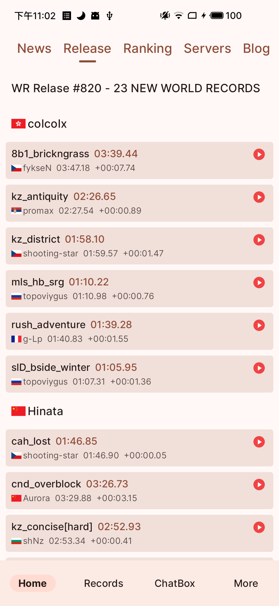
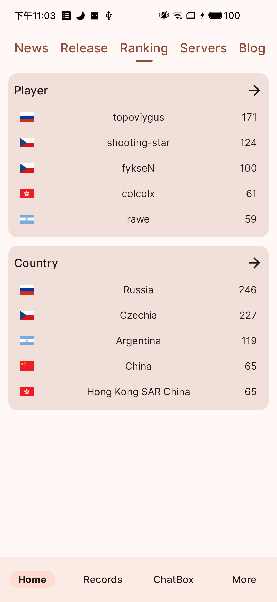
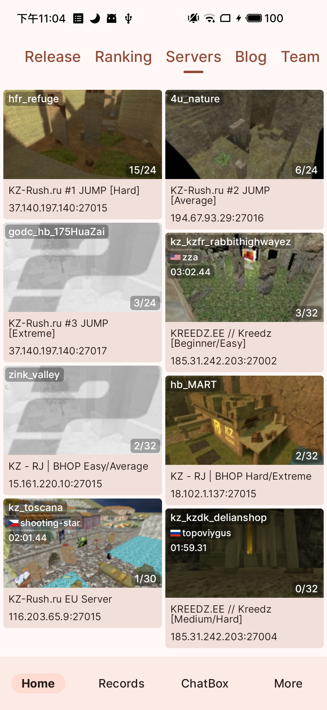
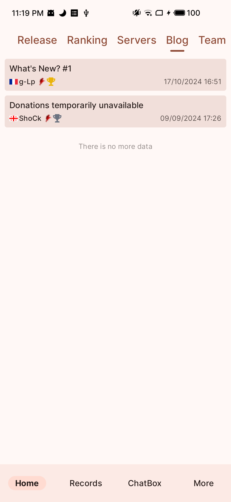
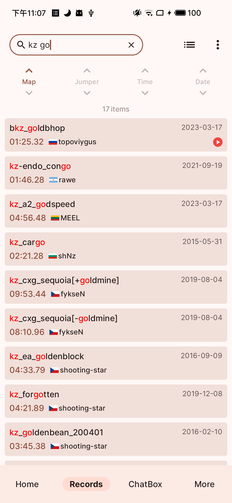
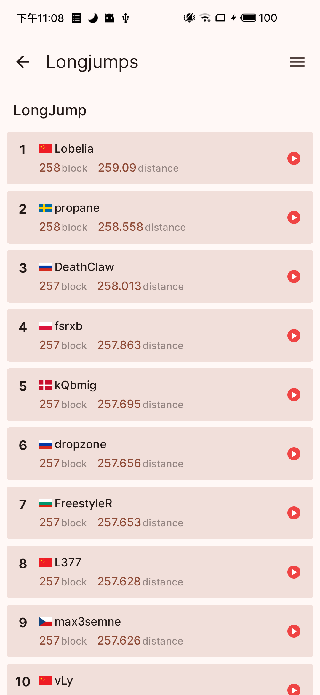
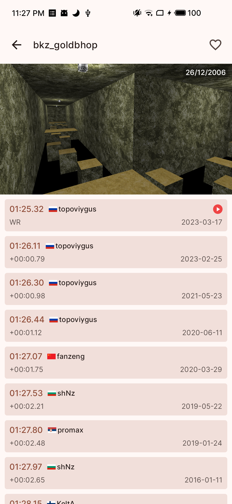
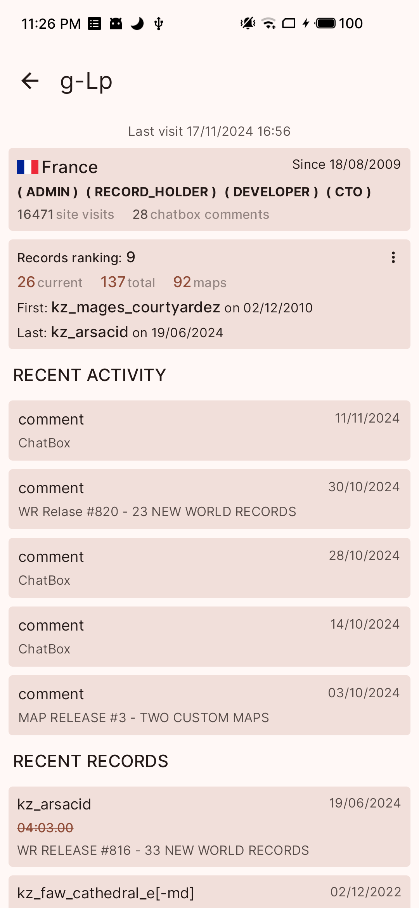
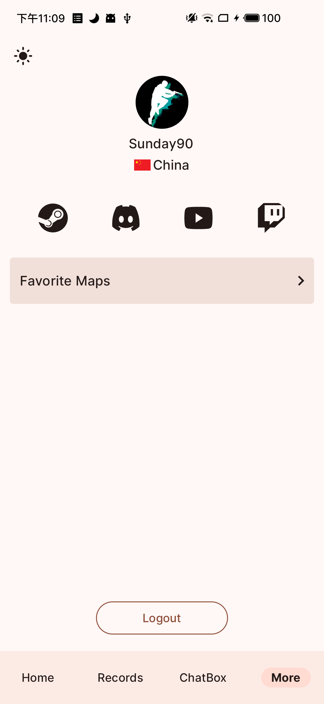

# Kreedz-android-package

This repository is prepared for publishing the [Kreedz](https://kreedz.com/) android app.

You can download the installation package from the release page.

# Screenshots

  
  
  

  
  
  

  
  
  

  
  
  

